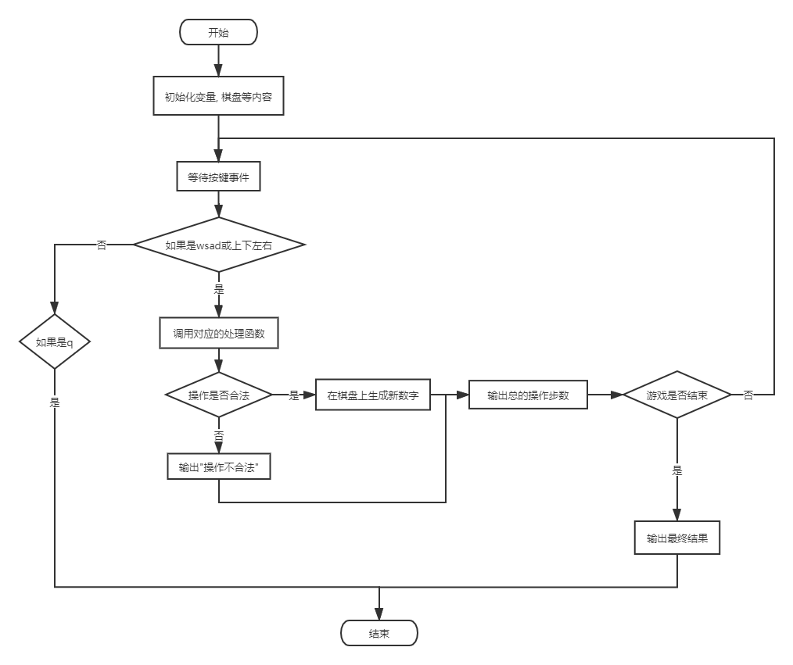
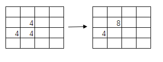
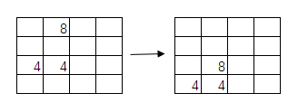
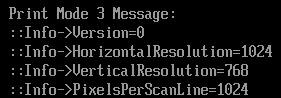
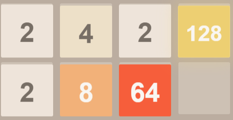

# 2048 for UEFI

## 项目概述

### 1. 项目简介

这个项目是一个在Uefi环境中可运行的2048小游戏. 游戏的最终目标是通过组合,  最终得到2048. 而如果最后无法继续移动且未得到2048, 则认为玩家失败. 
游戏具有图形界面, 同时内置了一个简易的AI. 玩家可以在启动时选择是由自己游玩还是观察AI. 

游戏可以统计步数等信息, 也有一些对操作的提醒. 

### 2. 项目截图
 


## 项目结构

### 1. 项目整体架构

目录: 

```bash
└─MyPkg
    │  MyPkg.dec
    │  MyPkg.dsc
    │
    └─2048
            2048.inf
            ai.c
            board.c
            board.h
            gui.c
            main.c
```
 
整个项目包含在一个名为`MyPkg`的模块中. 而主要的源文件则存在子目录`2048`中, 包含编译配置文件`2048.inf`, 棋盘操作部分`board.h`和`board.c`, GUI模块`gui.h`, AI模块`ai.c`和程序主逻辑部分`main.c`. 

### 2. 模块定义文件: 

`MyPkg.dec`

该文件定义了可以供其他模块使用的数据接口, 是必需文件之一. 这个文件的内容如下, 因为`2048`使用到了C语言库, 因此这个文件的`[Includes]`部分包含了来自`Stdlib`的`Include`目录. 

```inf
[Defines]
  DEC_SPECIFICATION              = 0x00010006
  PACKAGE_NAME                   = MyPkg
  PACKAGE_GUID                   = 518D7206-48D3-4884-A821-4277BE766D53
  PACKAGE_VERSION                = 0.1

[Includes]
  ../StdLib/Include
  ../StdLib/Include/X64
```
 
`MyPkg.dsc`

该文件用于编译该`Package`, 也是必需的文件之一. 该文件由4部分组成. 

`Define`区定义了该模块相关的全局宏变量: 

```inf
[Defines]
  PLATFORM_NAME                  = MyPkg
  PLATFORM_GUID                  = 549867eb-059f-44d1-b1e1-13ec2f96c7a9
  PLATFORM_VERSION               = 0.01
  DSC_SPECIFICATION              = 0x00010006
  OUTPUT_DIRECTORY               = Build/MyPkg
  SUPPORTED_ARCHITECTURES        = IA32|IPF|X64
  BUILD_TARGETS                  = DEBUG|RELEASE
  SKUID_IDENTIFIER               = DEFAULT
```
 
`LibraryClasses`区定义了可以引用的库的名字及对应路径, 分为入口点类 Lib 和其他 Lib:

```inf
[LibraryClasses]
  #
  # Entry Point Libraries
  #
  UefiApplicationEntryPoint|MdePkg/Library/UefiApplicationEntryPoint/UefiApplicationEntryPoint.inf
  ShellCEntryLib|ShellPkg/Library/UefiShellCEntryLib/UefiShellCEntryLib.inf
  #kurt2013.03.05 add for UEFI driver, err:"Instance of library class [UefiDriverEntryPoint] is not found"
  UefiDriverEntryPoint|MdePkg/Library/UefiDriverEntryPoint/UefiDriverEntryPoint.inf
  DxeServicesLib|MdePkg/Library/DxeServicesLib/DxeServicesLib.inf
  #
  # Common Libraries
  #
  BaseLib|MdePkg/Library/BaseLib/BaseLib.inf
  BaseMemoryLib|MdePkg/Library/BaseMemoryLib/BaseMemoryLib.inf
  UefiLib|MdePkg/Library/UefiLib/UefiLib.inf
  PrintLib|MdePkg/Library/BasePrintLib/BasePrintLib.inf
  PcdLib|MdePkg/Library/BasePcdLibNull/BasePcdLibNull.inf
  MemoryAllocationLib|MdePkg/Library/UefiMemoryAllocationLib/UefiMemoryAllocationLib.inf
  UefiBootServicesTableLib|MdePkg/Library/UefiBootServicesTableLib/UefiBootServicesTableLib.inf
  UefiRuntimeServicesTableLib|MdePkg/Library/UefiRuntimeServicesTableLib/UefiRuntimeServicesTableLib.inf
  DebugLib|MdePkg/Library/BaseDebugLibNull/BaseDebugLibNull.inf
  DevicePathLib|MdePkg/Library/UefiDevicePathLib/UefiDevicePathLib.inf
  PeCoffGetEntryPointLib|MdePkg/Library/BasePeCoffGetEntryPointLib/BasePeCoffGetEntryPointLib.inf
  IoLib|MdePkg/Library/BaseIoLibIntrinsic/BaseIoLibIntrinsic.inf
  SynchronizationLib|MdePkg/Library/BaseSynchronizationLib/BaseSynchronizationLib.inf
  UefiRuntimeLib|MdePkg/Library/UefiRuntimeLib/UefiRuntimeLib.inf
  HiiLib|MdeModulePkg/Library/UefiHiiLib/UefiHiiLib.inf
  UefiHiiServicesLib|MdeModulePkg/Library/UefiHiiServicesLib/UefiHiiServicesLib.inf
  PerformanceLib|MdeModulePkg/Library/DxePerformanceLib/DxePerformanceLib.inf
```
 
这部分我们也并不是特别清楚哪些 Lib 是必需的而哪些 Lib 是非必需的, 于是就将`MdePkg`和`MdeModulePkg`中的大部分 Lib 都引用了过来. 

之后定义要编译的模块: 

```inf
[Components]
MyPkg/2048/2048.inf
```
 
编译选项: 

```inf
[BuildOptions]
INTEL:*_*_*_CC_FLAGS      = /Qfreestanding
```

最后, 因为项目使用到了 C 库函数, 还需要再加上一句声明: 

```inf
!include StdLib/StdLib.inc
```
 
### 3. 工程声明文件

`2048.inf`中声明了该工程的基本宏定义, 源文件, 引用的模块和链接库. 因为我们的程序以`main`为入口点, 故声明为 Shell 应用程序. 文件内容如下: 

```inf
[Defines]
  INF_VERSION                    = 0x00010006
  BASE_NAME                      = 2048
  FILE_GUID                      = F995E121-C34B-4870-8083-8408E9A4C6E1
  MODULE_TYPE                    = UEFI_APPLICATION
  VERSION_STRING                 = 1.0
  ENTRY_POINT                    = ShellCEntryLib

[Sources]
  main.c
  board.c
  board.h
ai.c
gui.c

[Packages]
  MdePkg/MdePkg.dec
  MdeModulePkg/MdeModulePkg.dec
  ShellPkg/ShellPkg.dec
  MyPkg/MyPkg.dec

[LibraryClasses]
  UefiApplicationEntryPoint
  UefiLib
  ShellCEntryLib
  LibC
  LibStdio
```
 
### 4. 源文件

#### 主要逻辑: `main.c`


 
键盘的读取(See P.81, P.105): 

```c
EStatus = gBS->WaitForEvent(
    1, 
    &(gST->ConIn->WaitForKey), 
    &Index
);
EStatus = gST->ConIn->ReadKeyStroke(gST->ConIn, &key);
```
 
操作判断: 

```c
if (key.UnicodeChar == L'w'|| key.ScanCode == 0x01){
    valid = board_move_up(&board);
} else if (key.UnicodeChar == L's'|| key.ScanCode == 0x02){
    valid = board_move_down(&board);
} else if (key.UnicodeChar == L'a'|| key.ScanCode == 0x04){
    valid = board_move_left(&board);
} else if (key.UnicodeChar == L'd'|| key.ScanCode == 0x03){
    valid = board_move_right(&board);
} else if (key.UnicodeChar == L'q'){
    break;
} else {
    //do nothing when press other keys
    continue;
}
```

 
#### 棋盘的实现: `board.h`

棋盘的实现使用了一个`unsigned int`的二维数组. 

```c
#define BOARD_COLUMNS 4
#define BOARD_ROWS 4
#define WIN_NUMBER  2048

struct board {
    unsigned tiles[BOARD_ROWS][BOARD_COLUMNS];
};
```

 
下面是`board.h`中声明的所有函数及其功能

|函数原型|功能及作用|
|-----|-----|
|`int board_done(struct board* board);`|判断当前棋盘是否结束|
|`unsigned board_get_tiles_empty(struct board* board).;`|统计剩余空位数|
|`void board_init(struct board* board).;`|初始化棋盘(全为0)|
|`void board_print(struct board* board).;`|打印棋盘|
|`int board_merge_down(struct board* board).;`|对能向下合并的元素进行向下进行合并|
|`int board_merge_left(struct board* board).;`|对能向左合并的元素进行向左进行合并|
|`int board_merge_right(struct board* board).;`|对能向右合并的元素进行向右进行合并|
|`int board_merge_up(struct board* board).;`|对能向上合并的元素进行向上进行合并|
|`int board_move_down(struct board* board).;`|合并并下移|
|`int board_move_left(struct board* board).;`|合并并左移|
|`int board_move_right(struct board* board).;`|合并并右移|
|`int board_move_up(struct board* board).;`|合并并上移|
|`void board_plop(struct board* board).;`|在空白处生成一个新元素(2或4)|
|`int board_shift_down(struct board* board).;`|对能下移的元素进行下移|
|`int board_shift_left(struct board* board).;`|对能左移的元素进行左移|
|`int board_shift_right(struct board* board).;`|对能右移的元素进行右移|
|`int board_shift_up(struct board* board).;`|对能上移的元素进行上移|
 
对于初始化棋盘, 打印棋盘, 计算空位数等均是简单遍历, 不再介绍. 

判断游戏是否结束, 首先先判断当前是否还有空位, 如果有的话, 即继续. 否则, 如果有2048, 则玩家胜利. 如果当前既无空位也无2048, 那么判断现在的局面是否可以继续操作. 如果无法继续操作了, 则玩家失败, 否则游戏继续. 

对于具体的棋盘操作, 这里以向下举例. 

首先调用`board_move_down`, 它包括两部分: `board_merge_down`和`board_shift_down`.

这是一个`board_merge_down`的例子: 


 
这是一个`board_shift_down`的例子


 
组合这两种操作, 即可完成所需的操作. 

#### GUI的实现

GUI的实现需要自己操作缓冲区. 核心api如下: 

```c
gGraphicsOutput->Blt(
     gGraphicsOutput, foreColor, EfiBltVideoFill, 0, 0, x, y, w, h, 0
);
```
 
##### 1. GUI的初始化与销毁

对于一个窗口而言, 如果想操作其画面, 需要将其指定为（`SetMode`）图形模式. 因此在初始化部分, 首先获得两个窗口的句柄（`Handle`）, 之后将一个指定为文本模式, 一个指定为图像模式. 在此过程中也获得了两个文本和图像协议指针作为后续操作的对象. 之后, 设定图像模式为`0x3`, 此模式下, 屏幕分辨率是`1024x768`. 


 
至于程序结束后的窗口销毁, 按照初始化的反向再进行一遍即可. 

关键代码如下: 

```c
EFI_SIMPLE_TEXT_INPUT_EX_PROTOCOL   *gSimpleTextInputEx;
EFI_GRAPHICS_OUTPUT_PROTOCOL        *gGraphicsOutput;
VOID InitGUI() {
    EFI_STATUS Status;
    Status=LocateSimpleTextInputEx();
    Status=LocateGraphicsOutput();
    SwitchGraphicsMode(TRUE);
    SetMyMode(0x3);
}

VOID DestoryGUI() {
    SetMyMode(0x0);
    SwitchGraphicsMode(FALSE);
}


EFI_STATUS SwitchGraphicsMode(BOOLEAN flag) {
    EFI_STATUS  Status;
    Status=gST->ConOut->EnableCursor (gST->ConOut, flag);
    return Status;
}

VOID SetMyMode(UINT32 ModeNumber) {
   gGraphicsOutput->SetMode(gGraphicsOutput, ModeNumber);
   return;
}

EFI_STATUS LocateSimpleTextInputEx(void) {
    EFI_STATUS Status;
    EFI_HANDLE *Handles;
    UINTN HandleCount;
    UINTN HandleIndex;

    Status = gBS->LocateHandleBuffer (
                ByProtocol,
                &gEfiSimpleTextInputExProtocolGuid,
                NULL,
                &HandleCount,
                &Handles
                );
    if(EFI_ERROR (Status)) return Status;

    for (HandleIndex = 0; HandleIndex < HandleCount; HandleIndex++) {
        Status = gBS->HandleProtocol (Handles[HandleIndex], &gEfiSimpleTextInputExProtocolGuid, (VOID **) &gSimpleTextInputEx);
        if (EFI_ERROR(Status))  
            continue;
        else {
            return EFI_SUCCESS;
        }
    }
    return Status;
}

EFI_STATUS LocateGraphicsOutput (void) {
    EFI_STATUS Status;
    EFI_HANDLE *GraphicsOutputControllerHandles = NULL;
    UINTN HandleIndex = 0;
    UINTN HandleCount = 0;
    //get the handles which supports GraphicsOutputProtocol
    Status = gBS->LocateHandleBuffer(
        ByProtocol,
        &gEfiGraphicsOutputProtocolGuid,
        NULL,
        &HandleCount,
        &GraphicsOutputControllerHandles
        );
    if (EFI_ERROR(Status))  return Status;      //unsupport
    for (HandleIndex = 0; HandleIndex < HandleCount; HandleIndex++) {
        Status = gBS->HandleProtocol(
            GraphicsOutputControllerHandles[HandleIndex],
            &gEfiGraphicsOutputProtocolGuid,
            (VOID**)&gGraphicsOutput);
        if (EFI_ERROR(Status))  continue;

        else {
            return EFI_SUCCESS;
        }
    }
    return Status;
}
```
 
##### 2. 绘图

使用了前面所述的核心api, 并将几个高频操作封装成了相应的函数. 

1．	单像素

```c
VOID DrawPixel(UINTN x, UINTN y, EFI_COLOR *color) {
    gGraphicsOutput->Blt(
        gGraphicsOutput, color, EfiBltVideoFill, 0, 0, x, y, 1, 1, 0
    );
}
```
 
2．	直角矩形

```c
gGraphicsOutput->Blt(
    gGraphicsOutput, foreColor, EfiBltVideoFill, 0, 0, x, y, w, h, 0
);
```
 
3．	圆角

圆角的实现借助于单个像素点绘图功能. 给定顶点坐标以及该顶点的位置以及半径, 之后对以半径为边长的正方形的每个像素进行遍历, 使用新的颜色重新绘制圆角部分的像素, 造成一种圆角被切去的效果. 

```c
VOID DrawRadius(UINTN x_0, UINTN y_0, EFI_COLOR *bcgdColor, unsigned radius, UINT8 isLeft, UINT8 isTop) {
    UINTN dx, dy;
    for(dx = 0; dx <= radius; dx++) {
        for(dy = 0; dy <= radius; dy++) {
            if(dx * dx + dy * dy > radius * radius) {
                DrawPixel(
                    x_0 + (radius - dx) * (isLeft ? 1 : -1),
                    y_0 + (radius - dy) * (isTop ? 1 : -1), 
                    bcgdColor
                );
            }
        }
    } 
}
```
 
4．	圆角矩形

圆角矩形的实现是先画一个矩形, 之后用背景的颜色画四个角“被切去”的部分. 

```c
VOID DrawRoundedRectangle(UINTN x, UINTN y, UINTN w, UINTN h, EFI_COLOR *foreColor, EFI_COLOR *bkgdColor, unsigned radius) {
    gGraphicsOutput->Blt(
        gGraphicsOutput, foreColor, EfiBltVideoFill, 0, 0, x, y, w, h, 0
    );
    if(radius != 0) {
        DrawRadius(x     , y     , bkgdColor, radius, 1, 1);
        DrawRadius(x + w , y     , bkgdColor, radius, 0, 1);
        DrawRadius(x     , y + h , bkgdColor, radius, 1, 0);
        DrawRadius(x + w , y + h , bkgdColor, radius, 0, 0);
    }
}
```
 
5．	直接绘制第i行第j列的方块

只是一个简单的封装. 

```c
VOID ColorTile(UINT16 i, UINT16 j, EFI_COLOR *color) {
    DrawRoundedRectangle(
        MARGIN_LEFT + (TILE_WIDTH + GAP_WIDTH) * j + GAP_WIDTH,
        MARGIN_TOP  + (TILE_WIDTH + GAP_WIDTH) * i + GAP_WIDTH,
        TILE_WIDTH, TILE_WIDTH,
        color, board_backgd, RADIUS
    );
}
```
 
##### 3. 背景的绘制


 
背景指整个界面不需要发生变化的部分, 是其他元素的底板. 背景分为三层. 最下面是
整个页面的背景, 往上一层是棋盘的背景, 再向上一层是每个小格的背景. 这三层的颜色存储在如下的结构中, 并提供了3个宏以便快速取用. 

```c
#define body_backgd         &(backgroundBuffer[0])
#define board_backgd        &(backgroundBuffer[1])
#define tile_backgd         &(backgroundBuffer[2])

EFI_GRAPHICS_OUTPUT_BLT_PIXEL backgroundBuffer[] = {
    239, 248, 250,   0,         // #faf8ef, body_backgd
    160, 173, 187,   0,         // #bbada0, board_backgd
    180, 193, 205,   0,         // #cdc1b4, tile_backgd
};
```
 
具体的绘制操作也分为三步. 先整体的背景, 再棋盘背景, 之后是16个小块背景. 

```c
gGraphicsOutput->Blt(gGraphicsOutput, body_backgd, EfiBltVideoFill, 0, 0, 0, 0, 1024, 768, 0);
DrawRoundedRectangle(
    MARGIN_LEFT, MARGIN_TOP,  
    (TILE_WIDTH + GAP_WIDTH) * BOARD_COLUMNS + GAP_WIDTH,
    (TILE_WIDTH + GAP_WIDTH) * BOARD_ROWS + GAP_WIDTH,
    board_backgd, body_backgd, RADIUS
);
for(i = 0; i < BOARD_ROWS; i++) {
    for(j = 0; j < BOARD_COLUMNS; j++) {
        ColorTile(i, j, tile_backgd);
    }
}
```
 
##### 4. 文字显示

文字显示的逻辑实质上是先将文字渲染成位图, 之后写入缓冲区. 基于HII我们可以封装一个自己的写文字的函数, 这里不再详细介绍. 

```c
VOID WriteStrOnPosition(
    CHAR16* str, 
    UINTN x, UINTN y, 
    EFI_COLOR fontColor, 
    EFI_COLOR backgdColor,
    EFI_HII_FONT_STYLE fontStyle,
    UINT16 fontSize
) {
    #pragma warning( disable: 4204)
    EFI_FONT_DISPLAY_INFO fontDisplayInfo = {
        fontColor, 
        backgdColor,
        EFI_FONT_INFO_ANY_FONT,
        {fontStyle, fontSize, L'0'}
    };
    EFI_STATUS Status;
    EFI_IMAGE_OUTPUT sc_p = {
        (UINT16) gGraphicsOutput->Mode->Info->HorizontalResolution,
        (UINT16) gGraphicsOutput->Mode->Info->VerticalResolution,
        NULL
    };
    EFI_IMAGE_OUTPUT* Screen = &sc_p;
    Screen->Image.Screen = gGraphicsOutput;
    Status = gHiiFont->StringToImage(
        gHiiFont,
        EFI_HII_IGNORE_IF_NO_GLYPH | EFI_HII_OUT_FLAG_CLIP | 
        EFI_HII_OUT_FLAG_CLIP_CLEAN_X | EFI_HII_OUT_FLAG_CLIP_CLEAN_Y | 
        EFI_HII_IGNORE_LINE_BREAK | EFI_HII_DRAW_FLAG_TRANSPARENT |
        EFI_HII_DIRECT_TO_SCREEN, 
        (CHAR16 *) str, (EFI_FONT_DISPLAY_INFO *) (& fontDisplayInfo),
        &Screen,
        (UINTN) x, (UINTN) y,
        NULL, NULL, NULL
    );
}
```
 
##### 5. “砖块”的渲染

渲染的原则是差异更新, 只对发生变化的区块进行重新绘制, 以保证应用性能. 为此, 我们维护了一个棋盘数组的缓存, 在渲染时找其中差异化的区块. 


 
另外, 不同数值的砖块, 其砖块颜色和字体颜色均不同. 因此需要使用函数来进行`数字->颜色`的转换工作. 

如下: 

```c
VOID UpdateBoardGUI(struct board* srcBoard) {
    UINT16 i, j;
    for(i = 0; i < BOARD_ROWS; i++) {
        for(j = 0; j < BOARD_COLUMNS; j++) {
            if(preBoard.tiles[i][j] != srcBoard->tiles[i][j]) {
                unsigned num = srcBoard->tiles[i][j];
                EFI_COLOR *tileColor = NumToTileColor(num);
                EFI_COLOR *fontColor = NumToFontColor(num);
                ColorTile(i, j, tileColor);

                if(num != 0) {
                    char str_t[10];
                    sprintf(str_t, "%4d", num);
                    CHAR16 str_t_16[30];
                    unsigned ii;
                    for(ii = 0; ii < sizeof(str_t) / sizeof(char); ii++){
                        str_t_16[ii] = (CHAR16) str_t[ii];
                    }
                    WriteStrOnPosition(
                        str_t_16,
                        MARGIN_LEFT + (TILE_WIDTH + GAP_WIDTH) * j + GAP_WIDTH + TILE_WIDTH / 2,
                        MARGIN_TOP  + (TILE_WIDTH + GAP_WIDTH) * i + GAP_WIDTH + TILE_WIDTH / 2,
                        *fontColor,
                        *tileColor,
                        EFI_HII_FONT_STYLE_BOLD,
                        30
                    );
                }
                preBoard.tiles[i][j] = srcBoard->tiles[i][j];
            }
        }
    }
}
```
 
##### 6. 其他
除此之外, 界面上还有其他的一些部分. 例如总步数, 无效操作提示等等, 这里不再详细阐述. 

#### AI的实现

AI实质上只是简单的分数计算, 这部分也不是我们所做的重心. 

## 编译运行

```bash
edksetup.bat
build -p MyPkg\MyPkg.dsc -a IA32
copy Build\MyPkg\DEBUG_VS2015\IA32\2048.efi Build\NT32IA32\DEBUG_VS2015\IA322048.efi
build run
fs0:
2048.efi
```

## 总结

作者本人我不是很清楚, 但《UEFI原理与编程》这本书确实不太行. . 除了前两张有相对完整的示例之外, 全书其他位置就再也没有完整的示例了. 所有需要定义在dsc和inf中的依赖, 链接等等一概不提, 甚至一些api的头文件是什么都只字不谈. 只是简单地罗列了api的原型, 但还不如直接看edk源码（实际上也确实是这么做的）. 此外, 还有很多错误, 误导和浪费了不少时间. 

这个方面的资料太少了, 国内几乎找不到相应的材料, 就连Google上的英文资料也是少之又少, 很多地方还是需要自己去翻源码才写得出来. 

最后, Thanks For:

[kurtqiao/MyPkg](https://github.com/kurtqiao/MyPkg)

[易也技术 Blog](http://yiiyee.cn/blog/)


